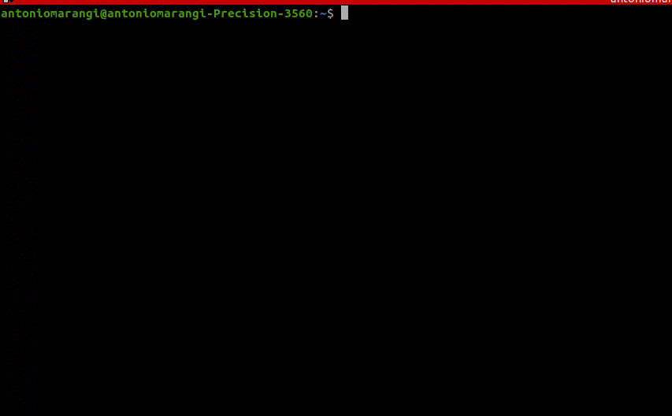

# INSTALL
clone the repository and run the following command in the root directory of the project:
```bash
bash install.sh
```
# USAGE
```bash
supermariobros
```
This command will show the ASCII art of Mario Bros.
```bash
ssn
```
This command will show the ASCII art of Mario Bros and shutdown the computer.

Remember to turn up the volume to enjoy the soundtrack :)



# UNINSTALL

To uninstall the program:
- Remove the folder /home/$USER/.super_mario_bros
- Remove the alias from the .bashrc file
- Remove the line "$USER ALL=(ALL) NOPASSWD: /sbin/poweroff, /sbin/reboot, /sbin/shutdown, /bin/strace" from /etc/sudoers